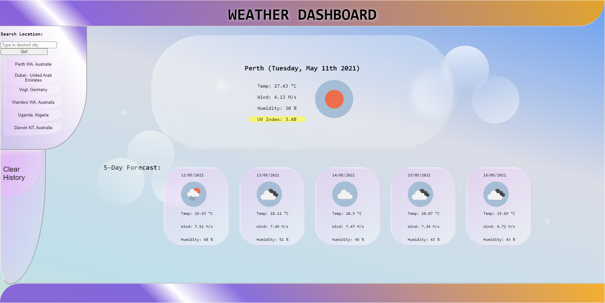
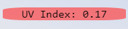
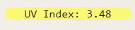
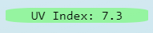
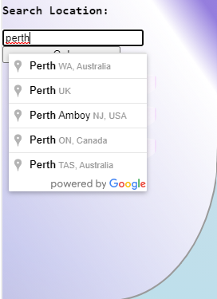

# WEATHER-DASHBOARD
UWA Web Dev Bootcamp - feb 2021
app to fetch the local weather

### REPO: https://github.com/Twistedmouse/WEATHER-DASHBOARD
### DEPLOYED: https://twistedmouse.github.io/WEATHER-DASHBOARD/

<br>

<p>Disclaimer: When button is added too to search history, page must be refreshed to use the button a second time. Only the new button though. I know its to do with the way im fetching so I have a few plans to try to fix this when i have more time.  
</p>

---

<br>

## THE TASK AT HAND:

Build a weather app that can predict the weather for the current day and the next 5 following days, with cities searched saved into a search history section. 

<br>

### User Story

```
AS A traveler
I WANT to see the weather outlook for multiple cities
SO THAT I can plan a trip accordingly
```

### Acceptance Criteria

```
GIVEN a weather dashboard with form inputs
WHEN I search for a city
THEN I am presented with current and future conditions for that city and that city is added to the search history
WHEN I view current weather conditions for that city
THEN I am presented with the city name, the date, an icon representation of weather conditions, the temperature, the humidity, the wind speed, and the UV index
WHEN I view the UV index
THEN I am presented with a color that indicates whether the conditions are favorable, moderate, or severe
WHEN I view future weather conditions for that city
THEN I am presented with a 5-day forecast that displays the date, an icon representation of weather conditions, the temperature, the wind speed, and the humidity
WHEN I click on a city in the search history
THEN I am again presented with current and future conditions for that city
```

<br>

---

<br>

## TECH:

<ul>
<li> HTML </li>
<li> JAVASCRIPT </li>
<li> CSS </li>
<li> Open Weather map api https://openweathermap.org/api </li>
<li> Google maps api https://developers.google.com/maps/documentation/javascript/overview </li>
</ul>

<br>

---

<br>

## DESIGN: 

<p> My design was mostly based around something easy to look at for a daily use, with cloud like objects and sun flare. I'v used a 
moving gradient as my background, and large rounded shapes with a blur filter for something interesting and easy to look at as well. </p>



<br>

<p>Another slight style feature is depending on the uv severity will change the color of the index.</p>





<p>I have also added little bubbles around the page, that pulse in and out of the background to create a bit more atmosphere.  </p>


<br>

<p>And by using the google maps api I have an autofill / predictive text feature in my search bar.</p>



<br>

---

<br>

## DEMO:

<p>Here is a demo of how the app should function.</p>


<p> </p>

<br>

---

<br>

## FUTURE PLANS:

<p>When I get more time in the future I would like to fix the issue with search history, where you need to 
refresh the page to review the latest button. I believe I just need to rewrite my fetch function, but this will do for first release. Or I could create a refresh page function, providing I develope a load last in local storage function. I would also like to make only 6 or so items be able to be stored in the search history.   </p>
<p> I would like to add when the page first loads it either shows the last searched location from local storage or users local area. Finally i would also like to make the page more responsive on other devices, such as changing the grid for the 5 day report and removing the footer bar on smaller devices. </p>

<br>

---

---

<br>

<footer>🎮 Created and Designed by Tristan Fontanini. 🐭</footer>